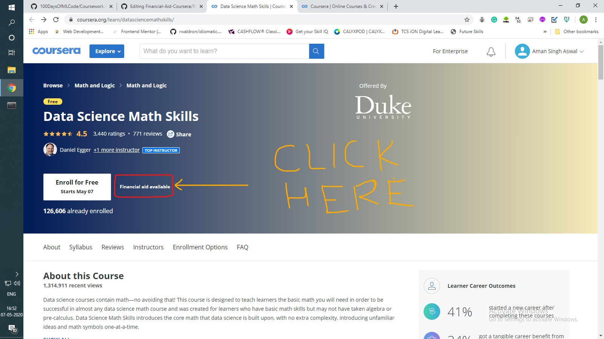
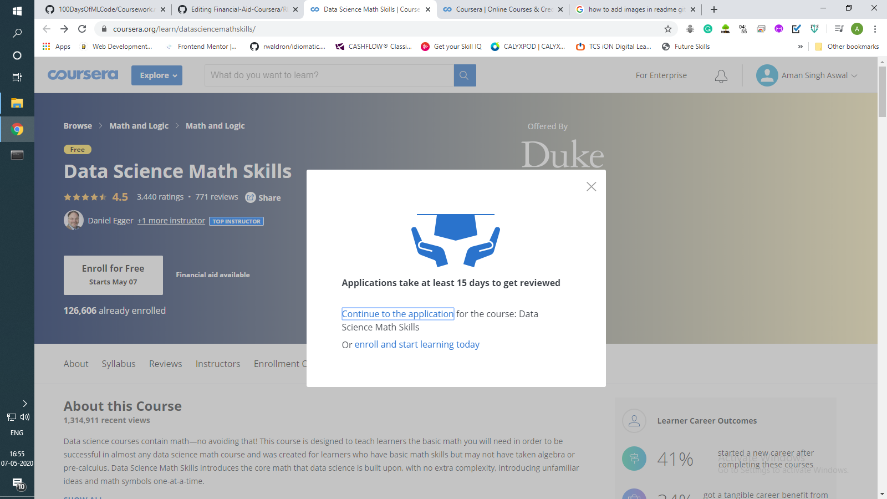
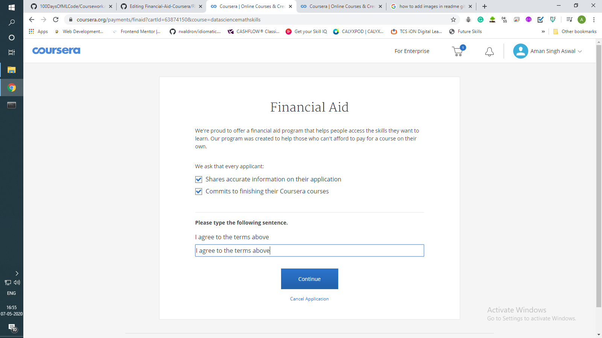
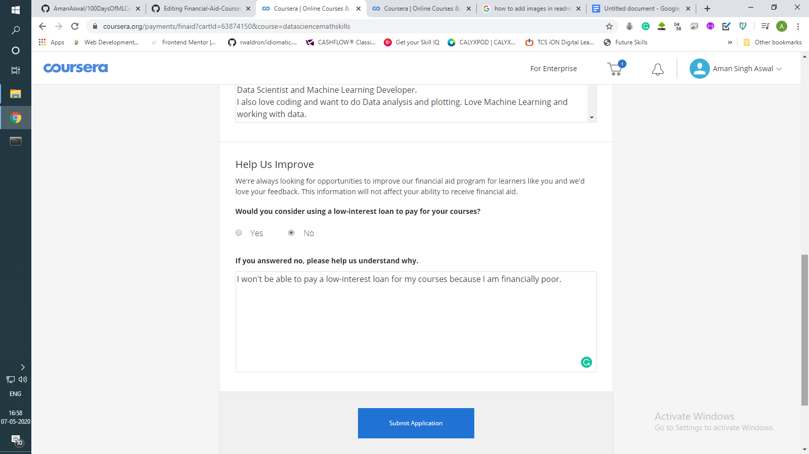
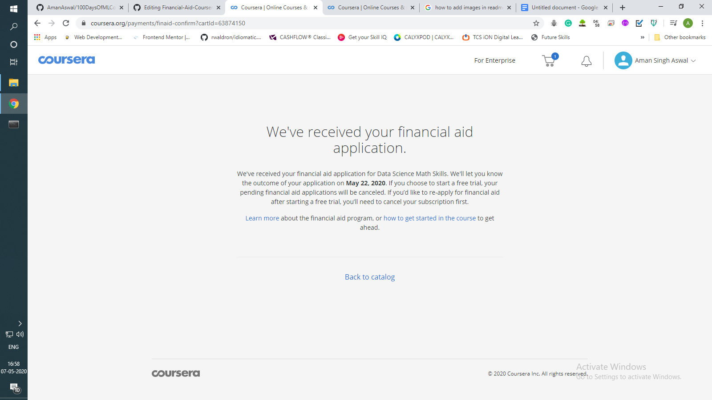

# Financial-Aid-Coursera
Steps to get any paid course for <b>free</b> in Coursera via applying Financial Aid. You will also get a certificate after completion of course.

<b>Steps</b>  
#### 1. Open the website in a new tab -> https://www.coursera.org/
#### 2. Search for the course.  
#### 3. The screen will appear.   

  

#### 4. Click on "Continue to the application"
 

#### 5. Mark the ticks, fill the box and continue.
 

 

#### 6. Fil the form and click on submit button. (You can always Google if you can't fill the answers of the questions)
 

 

#### ALL done! Wait for 15 days to get the course.
 

 

### Connect me on Linkedin: https://www.linkedin.com/in/aman-singh-aswal-300396183/
